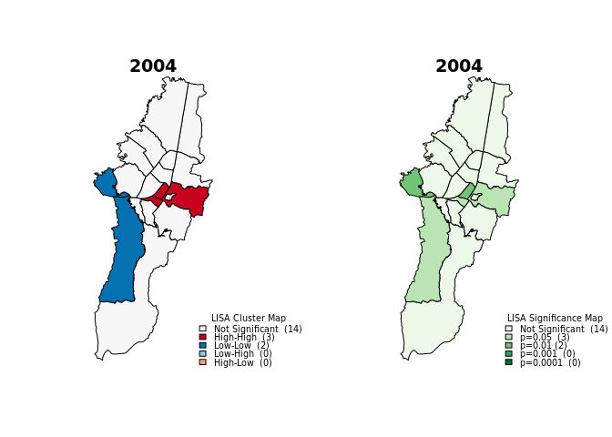
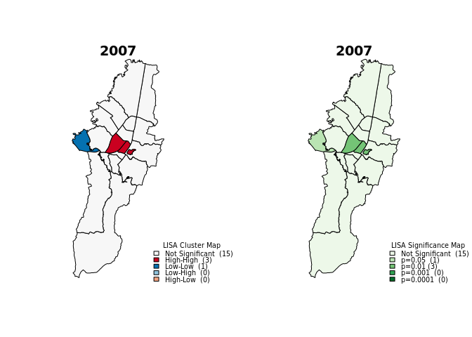
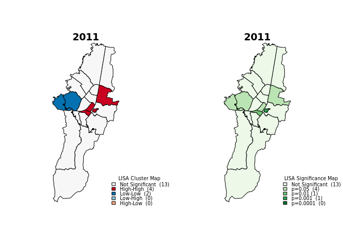
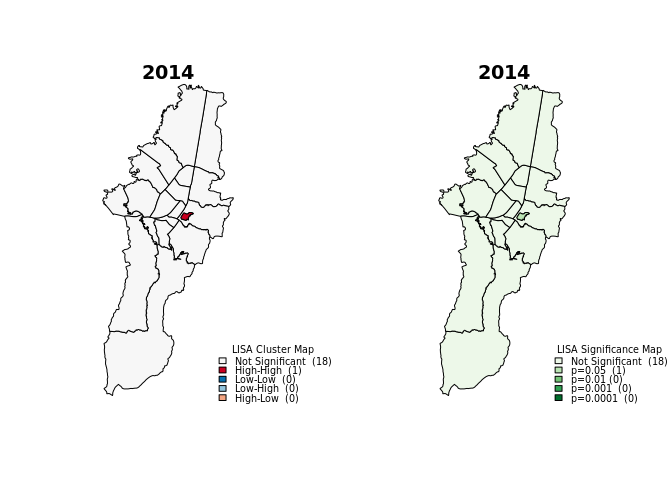
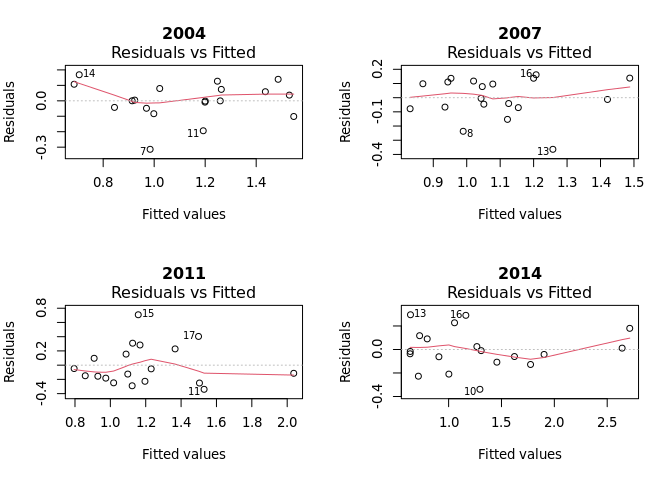

This is a reproducible example of the paper [Pneumonia Sar](). In this research, we perform a spatial autorregresive model analysis to measure the spatial influence of socio-economic, enviromental, behavioural and healthcare factors in pneumonia mortality rates. 

# Getting Started

## Packages

First, we will load the packages needed for processing and analyzing our data.


```r
# Omitting warmings (be carefull)
options(warn = -1)

# Packages
packages <- c('lmtest','RColorBrewer','classInt','spdep','TeachingDemos','shapefiles','sp','maptools',
             'scatterplot3d','geoR','spatial','fBasics','car','aplpack','RODBC','ggplot2','spgrass6',
             'adespatial','RANN','ade4','olsrr','rgeos','rgdal','spdep','spgwr','GWmodel','nnet','olsrr',
             'stats','classInt','gridExtra','lmtest','car','MASS','caret','glmnet')
```

For loading and/or installing the packages, you can run the following command. The packages that are installed in your machine will be automatically loaded. Those that are not installed will be installed and loaded to your R session. Remember to provide permits if linux is used as operative system.


```r
# Permits
#Sys.setenv(R_INSTALL_STAGED = FALSE)

# Load packages
for(p in packages){
  if(!require(p,character.only = TRUE)) install.packages(p, dependencies = TRUE)
  library(p,character.only = TRUE)
}
```

## Working directory

It is easier to work in R using a working directory. That way you ensure your inputs and outputs will be loaded and stored in a global directory.


```r
# Set working directory
dir <- '/mnt/d/M.Sc. Gesopatial Tecnologies/GeoMundus/GeoMundus 2019/Neumonia'
setwd(file.path(dir))
```

We will also use some useful functions in the exploratory analysis. Load them all from the *SpatialFunctions* folder. Remember this folder has to be in your current working directory.


```r
# Load some useful functions
funDir <- file.path(dir, 'SpatialFunctions')
spFun <- list.files(funDir, pattern = '.r', full.names = T)
invisible(lapply(spFun, source))
```

And we will add an extra function for resting the plot options everytime we plot.


```r
# Reset par for sequential plotting
resetPar <- function() { dev.new(); op <- par(no.readonly = TRUE); dev.off(); op}
```

# Data

Our data contains the [standardized mortality ratio (SMR)](https://ibis.health.state.nm.us/resource/SMR_ISR.html#:~:text=Standardized%20Mortality%20Ratio%20(SMR)%20is,the%20same%20age%2Fsex%20groups.) of Pneumonia (our study variable) in 19 districts of Bogotá, Colombia for the years 2004, 2007, 2011 and 2014. The data also contains socio-economic, enviromental and healthcare covariates.

As our data is stored in a *shapefile (.shp)* format, we will load it like so.


```r
# Load Data
years <- list('04','07','11','14')
pneuData <- paste0(dir, '/SHPFinal/Neumonia', years, '.shp')
```

And then we will read it using the `sp` package.


```r
# read Data
pneuShp <- lapply(pneuData, st_read)
pneuNames <- as.character(paste0('pneu',years))
names(pneuShp) <- pneuNames
```

# Exploratory Analysis

## Spatial weights matrix

One of the main aspects of any spatial autorregresive model is the contiguity matrix, also known as the spatial weights matrix ($\mathbf{W}$). This matrix encodes the spatial dependence and influence of one region with its neighbors. There are many ways to define $\mathbf{W}$. Usually, an expert proposes a potential spatial weights matrix based on their knowledge of the phenomenon (study variable). For our research, we will consider most of the parametric matrices configurations as we do not make any assumptions about the underlying spatial structure of the SMR variable. 


```r
# Contiguity criteria

# Queen
queenW <- lapply(pneuShp, poly2nb)
# Root
rootW <- lapply(pneuShp, poly2nb, queen = F)

# Distance criteria

# Coords
coords <- lapply(pneuShp, function(x) {st_sfc(st_centroid(x$geometry))})

# Delanuay Triangulation
triangW <- lapply(coords, tri2nb)
# Sphere of Influence
sphereW <- lapply(1:length(pneuNames), function(x) {graph2nb(soi.graph(triangW[[x]], coords[[x]]))})
names(sphereW) <- pneuNames
# Gabriel
gabrielW <- lapply(1:length(pneuNames), function(x) {graph2nb(gabrielneigh(coords[[x]]), sym = T)})
names(gabrielW) <- pneuNames
# Relative Neighbors
relativeW <- lapply(1:length(pneuNames), function(x) {graph2nb(relativeneigh(coords[[x]]), sym = T)})
names(relativeW) <- pneuNames

# K-neighbors critreria

# Polygons IDs
IDs <- row.names(as.data.frame(pneuShp$pneu04))

# K-1 neighbor
kn1W <- lapply(1:length(pneuNames), function(x) {knn2nb(knearneigh(coords[[x]], k = 1), row.names = IDs)})
names(kn1W) <- pneuNames

# K-2 neighbors
kn2W <- lapply(1:length(pneuNames), function(x) {knn2nb(knearneigh(coords[[x]], k = 2), row.names = IDs)})
names(kn2W) <- pneuNames

# K-4 neighbors
kn4W <- lapply(1:length(pneuNames), function(x) {knn2nb(knearneigh(coords[[x]], k = 4), row.names = IDs)})
names(kn4W) <- pneuNames
```

Now we plot the matrices to check the relationships among regions.


```r
# Plot weights matrices
op=par(mfrow=c(3,3), oma=c(0,0,0,0), mar=c(1,1,1,1))
matrices <- c('queen','root', 'triang', 'sphere', 'gabriel', 'relative', 'kn1', 'kn2', 'kn4')

for (w in matrices){
  plot(st_geometry(pneuShp$pneu04), border = 'gray')
  plot(get(paste0(w, 'W'))$pneu04, coords$pneu04, add=T,  pch=20, cex.main=1.5 , col="gray25")
  title(w)
}
```

<!-- -->

### Principal coordinates of neighbour matrices (PCNM) {-}

Now we will evaluate the best matrix for our data. We will use the [Principal coordinates of neighbour matrices (PCNM)](https://www.sciencedirect.com/science/article/abs/pii/S0304380006000925) as our selection criteria. For further details, please refer to the PCNM method.

First we will create a function to extract the AIC of the PCNM method to compare and extract the best matrix per each year.


```r
## Spatial weights matrices PCNM

# Function to get AIC for each matrix
getMatrixAIC <- function(x, w){
  pcnm <- test.W(pneuShp[[x]]$SMR, w[[x]])
  aic <- pcnm$all$AICc
  return(aic)
}
```
 
And then we will get the AIC values.


```r
# empty list
pcnm <- list()
# Get AICs
for (w in matrices){
  aic <- lapply(1:length(pneuNames), function(x){getMatrixAIC(x,get(paste0(w, 'W')))})
  pcnm[[w]] <- aic
}
```
These are the best matrices per year based on the AIC value.


```r
# AICs per year and matrix
pcnm <- as.data.frame(do.call(rbind, pcnm))
names(pcnm) <- pneuNames
pcnm
```

```
##             pneu04    pneu07    pneu11    pneu14
## queen    -68.77277 -58.97563 -48.16067 -31.85952
## root     -61.15346 -61.13476  -48.8688 -25.39557
## triang   -61.19358 -66.05321 -62.92984 -23.53263
## sphere   -53.70998  -71.8989 -55.78013 -24.97818
## gabriel  -55.85301 -63.07068 -57.84765 -27.43804
## relative -55.71152 -71.29338 -59.65928 -35.22539
## kn1      -59.24907 -66.80696 -56.95576  -20.2536
## kn2      -67.48367 -83.38051 -58.48591  -42.9033
## kn4      -53.45341  -80.2701 -70.07799 -29.22466
```

```r
# Best weights matrices per year (based on AIC)
bestMatrices <- lapply(1:length(pneuNames),function(x){rownames(pcnm[which.min(pcnm[[x]]),])})
names(bestMatrices) <- pneuNames # 2004: queen, 2007: kn2, 2011: kn4, 2014; kn2
bestMatrices
```

```
## $pneu04
## [1] "queen"
## 
## $pneu07
## [1] "kn2"
## 
## $pneu11
## [1] "kn4"
## 
## $pneu14
## [1] "kn2"
```
### Moran's Index {-}

We will confirm the PCNM finding using the Moran's Index of our study variable and the spatial weights matrices. We expect to find spatial autocorrelation between the SMR and $\mathbf{W}$. We will use the Moran's I statistically significant $p-value$ to assess the matrices. 


```r
## Compute Moran's I to asses matrices

#set seed
set.seed(123)

# Moran's I test
getMoranPvalue <- function(x, w){
  moran <- moran.mc(pneuShp[[x]]$SMR, nb2listw(w[[x]]), nsim = 1000, zero.policy = TRUE)
  p <- moran$p.value
  return(p)
}

# empty list
moranp <- list()
# Get p values
for (w in matrices){
  pvalue <- lapply(1:length(pneuNames), function(x){getMoranPvalue(x,get(paste0(w, 'W')))})
  moranp[[w]] <- pvalue
}

# p-values per year and matrix
moranp <- as.data.frame(do.call(rbind, moranp))
names(moranp) <- pneuNames # 2004: queen, 2007: kn2, 2011: kn4, 2014: queen
moranp
```

```
##              pneu04     pneu07      pneu11      pneu14
## queen    0.03396603  0.1188811  0.04995005  0.04395604
## root     0.01798202  0.1658342  0.02297702  0.01798202
## triang    0.1048951  0.1258741 0.000999001 0.000999001
## sphere   0.02597403  0.1228771 0.007992008  0.02997003
## gabriel  0.06393606  0.1468531 0.000999001 0.008991009
## relative 0.02097902  0.1378621  0.01598402   0.1198801
## kn1      0.08591409 0.01398601  0.00999001   0.1868132
## kn2      0.06193806 0.07392607  0.00999001   0.2127872
## kn4      0.05294705 0.09090909 0.000999001  0.01998002
```

And now having the matrices selected by both the PCNM method and the Moran's I, we chose our final $\mathbf{W}$'s for our study period. We selected the matrices whose PCNM's *AIC* were the lowest and Moran's I $p-values$ were statistically significant.


```r
# Selectec matrices based on both PCNM and Moran's I
spatialW <- c('queenW','kn2W', 'kn4W', 'queenW')
```

Now, let us plot the Moran's I of our selected matrices.


```r
# Plot Moran's I
par(resetPar())
op=par(mfrow=c(2,2))
for (i in 1:length(spatialW)){
  moran.plot(pneuShp[[i]]$SMR, nb2listw(get(spatialW[[i]])[[i]]), xlab = 'SMR', ylab = 'Spatially lagged SMR', main = paste0('20', years[[i]], '\n ', spatialW[[i]] ))
}
```

<!-- -->

### Higher order matrices {-}

We also want to know if our matrices  have statistically significant spatial lags or greater orders, that is, finding autocorrelation throughout longer distances or neighbors orders. If we find statistically significant orders of the matrices, we have to include them in the spatial autorregresive models to guarantee a proper inclusion of the spatial dependence among the regions.


```r
# Plot Moran's I correlograms
par(resetPar())
op=par(mfrow=c(2,2))
for (i in 1:length(spatialW)){
  correlogram <- sp.correlogram(get(spatialW[[i]])[[i]], pneuShp[[i]]$SMR, order=5, method= "I",style="W", zero.policy=T)
  print(correlogram)
  plot(correlogram, main = paste0('20', years[[i]], '\n ', spatialW[[i]] ))
} # Besides the first lag, the third lag is significative for 2004 and 2011
```

<!-- -->
We see that in 2004 and 2011 the 3rd order matrices are statistically significant. We will add the lagged variable as covariates to include them in the spatial autorregresive (SAR) models.


```r
# Define spatial lag variables
lagQueenW3 <- nblag(queenW$pneu04, 3)[[3]]
lagKn4W3 <- nblag(kn4W$pneu11, 3)[[3]]

# Add spatial lags to original data
pneuShp$pneu04$lag3SMR <- lag.listw(nb2listw(lagQueenW3), pneuShp$pneu04$SMR)
pneuShp$pneu11$lag3SMR <- lag.listw(nb2listw(lagKn4W3), pneuShp$pneu11$SMR)
```

## Global Analysis

As an essential condition of the SAR models, the dependent variable (SMR), independent variables (covariates) or distrubances (error term) must exhibit spatial autocorrelation. This spatial autocorrelation can be present across study area (Global) or in specific regions (Local). The former can be found using both the Moran's I and Geary's C statistics. 

### Global Moran's I {-}

We will assess the presence of global spatial autocorrelation in our dependent variable using the global Moran's I.


```r
# Moran's I
moranI <- lapply(1:length(pneuNames), function(x) {moran.test(pneuShp[[x]]$SMR, nb2listw(get(spatialW[[x]])[[x]]))})
names(moranI) <- pneuNames
moranI
```

```
## $pneu04
## 
## 	Moran I test under randomisation
## 
## data:  pneuShp[[x]]$SMR  
## weights: nb2listw(get(spatialW[[x]])[[x]])    
## 
## Moran I statistic standard deviate = 1.9898, p-value = 0.02331
## alternative hypothesis: greater
## sample estimates:
## Moran I statistic       Expectation          Variance 
##        0.23413855       -0.05555556        0.02119646 
## 
## 
## $pneu07
## 
## 	Moran I test under randomisation
## 
## data:  pneuShp[[x]]$SMR  
## weights: nb2listw(get(spatialW[[x]])[[x]])    
## 
## Moran I statistic standard deviate = 1.5402, p-value = 0.06176
## alternative hypothesis: greater
## sample estimates:
## Moran I statistic       Expectation          Variance 
##        0.22110039       -0.05555556        0.03226555 
## 
## 
## $pneu11
## 
## 	Moran I test under randomisation
## 
## data:  pneuShp[[x]]$SMR  
## weights: nb2listw(get(spatialW[[x]])[[x]])    
## 
## Moran I statistic standard deviate = 3.8994, p-value = 4.821e-05
## alternative hypothesis: greater
## sample estimates:
## Moran I statistic       Expectation          Variance 
##        0.42364583       -0.05555556        0.01510198 
## 
## 
## $pneu14
## 
## 	Moran I test under randomisation
## 
## data:  pneuShp[[x]]$SMR  
## weights: nb2listw(get(spatialW[[x]])[[x]])    
## 
## Moran I statistic standard deviate = 1.8748, p-value = 0.03041
## alternative hypothesis: greater
## sample estimates:
## Moran I statistic       Expectation          Variance 
##        0.19958513       -0.05555556        0.01851956
```
As we can see, all years except 2007 exhibit global spatial autocorrelation using a significance level of $p-value$ < 0.05.

### Geary's C {-}

Geary's C is an attempt to determine if adjacent observations of the same phenomenon are correlated locally. We will use this statistics to check for local clusters in our study area. The results are very similar to those made by the Global Moran's I. 2007 does not exhibit spatial autocorrelation. 


```r
gearyC <- lapply(1:length(pneuNames), function(x) {geary.test(pneuShp[[x]]$SMR, nb2listw(get(spatialW[[x]])[[x]]), zero.policy=F)})
names(gearyC) <- pneuNames
gearyC
```

```
## $pneu04
## 
## 	Geary C test under randomisation
## 
## data:  pneuShp[[x]]$SMR 
## weights: nb2listw(get(spatialW[[x]])[[x]]) 
## 
## Geary C statistic standard deviate = 1.9454, p-value = 0.02586
## alternative hypothesis: Expectation greater than statistic
## sample estimates:
## Geary C statistic       Expectation          Variance 
##        0.71801475        1.00000000        0.02101025 
## 
## 
## $pneu07
## 
## 	Geary C test under randomisation
## 
## data:  pneuShp[[x]]$SMR 
## weights: nb2listw(get(spatialW[[x]])[[x]]) 
## 
## Geary C statistic standard deviate = 0.50977, p-value = 0.3051
## alternative hypothesis: Expectation greater than statistic
## sample estimates:
## Geary C statistic       Expectation          Variance 
##        0.89449902        1.00000000        0.04283139 
## 
## 
## $pneu11
## 
## 	Geary C test under randomisation
## 
## data:  pneuShp[[x]]$SMR 
## weights: nb2listw(get(spatialW[[x]])[[x]]) 
## 
## Geary C statistic standard deviate = 3.2585, p-value = 0.0005601
## alternative hypothesis: Expectation greater than statistic
## sample estimates:
## Geary C statistic       Expectation          Variance 
##        0.55868473        1.00000000        0.01834302 
## 
## 
## $pneu14
## 
## 	Geary C test under randomisation
## 
## data:  pneuShp[[x]]$SMR 
## weights: nb2listw(get(spatialW[[x]])[[x]]) 
## 
## Geary C statistic standard deviate = 2.3687, p-value = 0.008926
## alternative hypothesis: Expectation greater than statistic
## sample estimates:
## Geary C statistic       Expectation          Variance 
##        0.63791091        1.00000000        0.02336808
```


### Bivariate Moran's I {-}

To find spatial association between the dependent variable and the covariates, we compute the bivariate Moran's Index. Covariates with statistically significant degree of spatial correlation with the SMR are initial potential candidates for the spatial autorregresive models. We will calculate the Moran's I $p-value$ and plot to scrutinized the covariates that spatially correlate with the SMR. 

The analysis is perform for the entier study period. However, for the sake of brevity, we will display only the results for 2014.


```r
# Change column names (data integrity)
for (y in 1:length(pneuNames)){
  for(col in 77:91){
    colnames(pneuShp[[y]])[col] <-  sub(paste0(years[[y]] ,'.*'), "", colnames(pneuShp[[y]])[col])
  }
}

# Bivariate Moran's I (p-value and plot)
par(resetPar())
op=par(mfrow=c(4,4), mar=c(4,4,1,1),oma=c(1,1,1,1))
for (col in c(78:88, 89:90)){
  mi <- moranbi.test(pneuShp$pneu14$SMR, pneuShp$pneu14[[col]], nb2listw(get(spatialW[[4]])[[4]]), N= 999)
  moranbi.plot(pneuShp$pneu14$SMR, pneuShp$pneu14[[col]], nb2listw(get(spatialW[[4]])[[4]]), N= 999,graph=T, quiet = T, main = paste0('I = ', round(mi$Observed,3), ', p-value = ', mi$p.value), xlab = 'SMR', ylab = colnames(pneuShp$pneu14[col])[1], cex.main=0.9)
} # For 2014 (For other years the variables need to be adressed for each dataset, that is, pneu'year'.  e.g., pneu07)


# 2004: TEM, CPM, CVV, ESC.
# 2007: NUT, IPSE
# 2011: CPM, CVV, CVD, ESC, IPSE
# 2014: CPM, NUT, DEP, NBI, CVV, VAC
```

<!-- -->
CPM, NUT, DEP, NBI, CVV and VAC show bivariate spatial autocorrelation with SMR. We will consider these variables in the SAR modeling as they can contribute to explaining our dependent variable.

## Local Analysis

As we see in the global analysis, such statistics (Moran’s I, Geary's C) are designed to identify global spatial autocorrelation (clustering). Such clustering is a characteristic of the complete spatial pattern and does not provide an indication of the location of the clusters.

Local analysis allows to assess the spatial correlation of each location with its local neighboorhood. For this analysis, we will use the Local Spatial Autocorrelation via the Moran's I and the Getis Ord statistic.

The global Moran's I informed us of local spatial autocorrelation in the study period. However, it does not determine the existence of clusters of high/low values.

### LISA maps (Moran's I) {-}

The Local Moran statistic identifies local clusters and local spatial outliers. Local Moran's I allows for a classification of the significant locations as High-High and Low-Low spatial clusters, and High-Low and Low-High spatial outliers.

We see that our data shows local clustering in the center of the city for almost every year except in 2014 wher eonly one region is statistically significant.


```r
invisible(lapply(1:length(pneuNames), function (x) {moran.cluster(pneuShp[[x]]$SMR, nb2listw(get(spatialW[[x]])[[x]]), zero.policy = T, pneuShp$pneu04$geometry, significant=T, main = paste0('20', years[[x]]))}))
```

<!-- --><!-- --><!-- --><!-- -->


### Getis Ord {-}

We corroborate the LISA results using the local statistic Getis Ord statistic.

Every year, except 2014, presents positive and statistically significant spatial clustering, that is, there are high values concentration in our study area. The results for 2014 usign Getis Ord are similar to those obtained throught the LISA Moran's I statistic, in which, spatial clustering was not found.


```r
# Getid's Ord
getisO <- lapply(1:length(pneuNames), function(x) {globalG.test(pneuShp[[x]]$SMR, nb2listw(get(spatialW[[x]])[[x]], style = 'B'))})
names(getisO) <- pneuNames
getisO
```

```
## $pneu04
## 
## 	Getis-Ord global G statistic
## 
## data:  pneuShp[[x]]$SMR 
## weights: nb2listw(get(spatialW[[x]])[[x]], style = "B") 
## 
## standard deviate = 2.4654, p-value = 0.006843
## alternative hypothesis: greater
## sample estimates:
## Global G statistic        Expectation           Variance 
##       2.690322e-01       2.456140e-01       9.022585e-05 
## 
## 
## $pneu07
## 
## 	Getis-Ord global G statistic
## 
## data:  pneuShp[[x]]$SMR 
## weights: nb2listw(get(spatialW[[x]])[[x]], style = "B") 
## 
## standard deviate = 2.3359, p-value = 0.009749
## alternative hypothesis: greater
## sample estimates:
## Global G statistic        Expectation           Variance 
##       0.1191726891       0.1111111111       0.0000119107 
## 
## 
## $pneu11
## 
## 	Getis-Ord global G statistic
## 
## data:  pneuShp[[x]]$SMR 
## weights: nb2listw(get(spatialW[[x]])[[x]], style = "B") 
## 
## standard deviate = 2.6555, p-value = 0.003959
## alternative hypothesis: greater
## sample estimates:
## Global G statistic        Expectation           Variance 
##       2.480737e-01       2.222222e-01       9.476995e-05 
## 
## 
## $pneu14
## 
## 	Getis-Ord global G statistic
## 
## data:  pneuShp[[x]]$SMR 
## weights: nb2listw(get(spatialW[[x]])[[x]], style = "B") 
## 
## standard deviate = 0.14643, p-value = 0.4418
## alternative hypothesis: greater
## sample estimates:
## Global G statistic        Expectation           Variance 
##       0.2484907062       0.2456140351       0.0003859437
```
# Spatial Autorregresive Models

Albeit the exploratory analysis insinuates the existence of spatial autocorrelation in our data, it does not inform about the level of influence of the independent variables or the underlying spatial dependence structure. The former can be addressed by performing a linear regression in which the independent variables' influence over the dependet variable can be assesed.

## Linear regression model

We will perform three different models to find the best combination of covariates that explain the SMR. We will not assume any dependence (except the ones found in the bivariate analysis) between the independet variables and the outcome variable (SMR). We select the classic Ordinary least squeare (OLS regression) and two regularized variations, the Lasso and the Elastic Net regression. The formers reduce the risk of overfitting, the variance, the correlation effect between variables and the influence of irrelevant predictors derived in a normal OLS regression. 

First, we will create a function that estimates, assesses and selects the best linear model among the three different regressions. For this, we use a leave one out cross-validation approach and we retain the model with the lowest Root-Mean-Square Error (RMSE) and AIC.


```r
selectLinearModel <- function(dataset, variablesNames, formula){
  
  # Data frame without geometry
  noGeoData <<- as.data.frame(dataset[variablesNames])
  noGeoData <<- noGeoData[,-ncol(noGeoData)]
  
  ### Variables criteria
  
  ### Stepwise Method
  m <- stats::step(lm(as.formula(formula), data = noGeoData), trace=0)
  # Get selected variables and compute regression
  formulaStep <- paste0(variablesNames[1], ' ~ ', paste(names(m$model)[-1], collapse = ' + '))
  steplm <- lm(as.formula(formulaStep) , data = noGeoData)
  
  ### Lasso method
  lasso <- cv.glmnet(x=as.matrix(noGeoData[,-1]), y=as.matrix(noGeoData$SMR), alpha=1, nfolds = nrow(noGeoData), type.measure="mse", family="gaussian", grouped = F)
  c <- coef(lasso, s = lasso$lambda.min)
  lassoPredictors <- row.names(c)[which(c!=0)][-1]
  # Get selected variables
  formulaLasso <- paste0(variablesNames[1], ' ~ ', paste(lassoPredictors, collapse = ' + '))
  lassolm <- lm(as.formula(formulaLasso) , data = noGeoData)
  
  ###  Elastic Net Method
  # Validation method
  train.control <- trainControl(method = "LOOCV")
  # Select optimal parameters (alpha and lambda)
  elastic_net <- train(as.formula(formula), data = noGeoData, method = "glmnet", trControl = train.control)
  alpha <- elastic_net$bestTune$alpha
  elastic <- cv.glmnet(x=as.matrix(noGeoData[,-1]), y=as.matrix(noGeoData$SMR), alpha= alpha, nfolds = nrow(noGeoData), type.measure="mse", family="gaussian", grouped = F)
  c <- coef(elastic, s = elastic$lambda.min)
  elasticPredictors <- row.names(c)[which(c!=0)][-1]
  # Get selected variables
  formulaElastic <- paste0(variablesNames[1], ' ~ ', paste(elasticPredictors, collapse = ' + '))
  elasticlm <- lm(as.formula(formulaElastic) , data = noGeoData)
  
  ### Cross validation
  
  # stepwise (AIC)
  stepcv <- train(as.formula(formulaStep), data = noGeoData, method = "lm", trControl = train.control)
  # Lasso
  lassocv <- train(as.formula(formulaLasso), data = noGeoData, method = "lm", trControl = train.control)
  # Elastic Net
  elasticcv <- train(as.formula(formulaElastic), data = noGeoData, method = "lm", trControl = train.control)
  
  RMSE <- c(stepcv$results$RMSE, lassocv$results$RMSE, elasticcv$results$RMSE)
  
  results <- cbind(RMSE)
  rownames(results) <- c('stepAIC', 'lasso', 'elasticNet')
  
  bestCriteria <- rownames(results)[which.min(results)]
  
  if (bestCriteria == 'stepAIC'){
    bestModel <- formulaStep
  } else if (bestCriteria == 'lasso'){
    bestModel <- formulaLasso
  } else{
    bestModel <- formulaElastic    
  }
  
  message(paste("The best criteria for selecting covariates is:", bestCriteria, "\nFormula selected model:\n", bestModel, '\n'))
  return(bestModel)
}
```

We define the covariates and the linear formula.


```r
# Variables Names
variablesNames <- c('SMR','IDD','TEM','CPM','DEP','NUT','CVV','CVD','ESC','IPSE','VAC','NBI','ACU')
# Set linear model
formula <- paste0(variablesNames[1], ' ~ ', paste(variablesNames[2:length(variablesNames)], collapse = ' + '))
```

And now we use the function we just created ```selectLinearModel```. For 2004, the Lasso and Elastic Net approach could not reach convergence, so we selected the OLS model as the best model. For 2007, 2011 and 2014 the best models were selected by the Lasso approach.


```r
#ols Model (2004)
model04 <- step(lm(as.formula(formula), data = pneuShp$pneu04), trace = 0)
# Get selected variables
formula2004 <- paste0(variablesNames[1], ' ~ ', paste(names(model04$model)[-1], collapse = ' + '))
cat('***2004***\n')
```

```
## ***2004***
```

```r
message(paste0('The best criteria for selecting covariates is: stepAIC 
Formula selected model:\n', formula2004,'\n'))
```

```
## The best criteria for selecting covariates is: stepAIC 
## Formula selected model:
## SMR ~ TEM + NUT + CVD + ESC + VAC
```

```r
# ols Models for 2007, 2011, 2014 (method failed with 2004)
olsModels <- lapply(2:length(pneuNames), function (x){ cat(paste0('***20', years[[x]], '***\n')); selectLinearModel(dataset = pneuShp[[x]], variablesNames = variablesNames , formula = formula)})
```

```
## ***2007***
```

```
## The best criteria for selecting covariates is: lasso 
## Formula selected model:
##  SMR ~ DEP + ESC + IPSE
```

```
## ***2011***
```

```
## The best criteria for selecting covariates is: stepAIC 
## Formula selected model:
##  SMR ~ CPM + CVV + IPSE + VAC + ACU
```

```
## ***2014***
```

```
## The best criteria for selecting covariates is: lasso 
## Formula selected model:
##  SMR ~ IDD + TEM + CPM + NUT + CVV + IPSE + VAC
```
The outcome linear models contain potential covariates that culd explain the SMR. We will save the models for further analysis.


```r
# Final OLS models
olsModels <- c(formula2004, olsModels)
names(olsModels) <- pneuNames
olslm <- lapply(1:length(pneuNames), function (x){lm(as.formula(olsModels[[x]]), data = pneuShp[[x]])})
names(olslm) <- pneuNames
```

### Residuals Analysis {-}

Autocorrelation in the model residuals, regardless of its nature, violates the OLS assumptions. If spatial autocorrelation is identified, a model that accounts for spatial dependence has to used instead.

We will assess the linear models' residuals to find residual spatial autocorrelation and to confirm the use of spatial autorregresive models for our data.


```r
# Spatial autocorrelation in residuals
lapply(1:length(pneuNames), function (x){
  lm.morantest(olslm[[x]], nb2listw(get(spatialW[[x]])[[x]]))
})   # only 2011 has residual spatial autocorrelation
```

```
## [[1]]
## 
## 	Global Moran I for regression residuals
## 
## data:  
## model: lm(formula = as.formula(olsModels[[x]]), data = pneuShp[[x]])
## weights: nb2listw(get(spatialW[[x]])[[x]])
## 
## Moran I statistic standard deviate = 1.2402, p-value = 0.1074
## alternative hypothesis: greater
## sample estimates:
## Observed Moran I      Expectation         Variance 
##       0.02231240      -0.12940269       0.01496444 
## 
## 
## [[2]]
## 
## 	Global Moran I for regression residuals
## 
## data:  
## model: lm(formula = as.formula(olsModels[[x]]), data = pneuShp[[x]])
## weights: nb2listw(get(spatialW[[x]])[[x]])
## 
## Moran I statistic standard deviate = 0.11585, p-value = 0.4539
## alternative hypothesis: greater
## sample estimates:
## Observed Moran I      Expectation         Variance 
##      -0.07056865      -0.09025602       0.02888145 
## 
## 
## [[3]]
## 
## 	Global Moran I for regression residuals
## 
## data:  
## model: lm(formula = as.formula(olsModels[[x]]), data = pneuShp[[x]])
## weights: nb2listw(get(spatialW[[x]])[[x]])
## 
## Moran I statistic standard deviate = 2.6324, p-value = 0.00424
## alternative hypothesis: greater
## sample estimates:
## Observed Moran I      Expectation         Variance 
##       0.19844785      -0.09649925       0.01255430 
## 
## 
## [[4]]
## 
## 	Global Moran I for regression residuals
## 
## data:  
## model: lm(formula = as.formula(olsModels[[x]]), data = pneuShp[[x]])
## weights: nb2listw(get(spatialW[[x]])[[x]])
## 
## Moran I statistic standard deviate = -0.42552, p-value = 0.6648
## alternative hypothesis: greater
## sample estimates:
## Observed Moran I      Expectation         Variance 
##      -0.21759796      -0.17145190       0.01176081
```
The Moran's I test in the linear regression residuals concluded that only 2011 has a spatial error dependence. Although 2004, 2007 and 2014 show no evidence of residual spatial autocorrelaton, we detected spatial dependence in the outcome variable. The results from the Moran's I in both the dependent variable and the OLS residuals suggest initial spatial autorregresive model configurations that considers the nature of this dependence. For instance, in 2011 we might need a model that accounts for spatial structure in the error term.

Now let us plot the Moran's I to visualize the results.


```r
#Plot moran's I
par(resetPar())
par(mfrow = c(2,2))
invisible(lapply(1:length(pneuNames), function (x){
  moran.plot(olslm[[x]]$residuals, nb2listw(get(spatialW[[x]])[[x]]), xlab = 'SMR', ylab = 'spatially lagged residuals' , main = paste0('20', years[[x]]))
}))
```

<!-- -->


### linear regression assumptions {-}


```r
par(resetPar())
par(mfrow=c(2,2))
invisible(lapply(1:length(pneuNames), function (x){
  lmyear <- olslm[[x]];
  cat(paste0('\n***** 20', years[[x]], ' *****\n'))
  # Linearity:
  plot(lmyear, which=c(1), main = paste0('20', years[[x]]))
  # Residuals normality: Shapiro Wilk test
  normality <- shapiro.test(residuals(lmyear))
  if (normality$p.value >= 0.05) {cat('Normal\n')} else {cat('non-normal\n')}
  # Heteroscedasticity: Breusch Pagan test
  homos <- bptest(lmyear)
  if (homos$p.value >= 0.05) {cat('Homocedastic\n')} else {cat('Heteroscedastic\n')}
  # Specificity: Ramsey's RESET test
  specif <- resettest(lmyear)
  if (specif$p.value >= 0.05) {cat('Good specified\n')} else {cat('Poorly specified\n')}
  # Multicolineality: VIF
  vif <- vif(lmyear)
  if (length(vif[vif > 10]) > 0) {cat('Multicolinearity\n')} else {cat('Non-multicolinearity\n')}
}))  # 2007 suffers of non-normality
```

```
## 
## ***** 2004 *****
```

```
## Normal
## Homocedastic
## Good specified
## Non-multicolinearity
## 
## ***** 2007 *****
```

```
## non-normal
## Homocedastic
## Good specified
## Non-multicolinearity
## 
## ***** 2011 *****
```

```
## Normal
## Homocedastic
## Good specified
## Non-multicolinearity
## 
## ***** 2014 *****
```

<!-- -->

```
## Normal
## Homocedastic
## Good specified
## Non-multicolinearity
```


