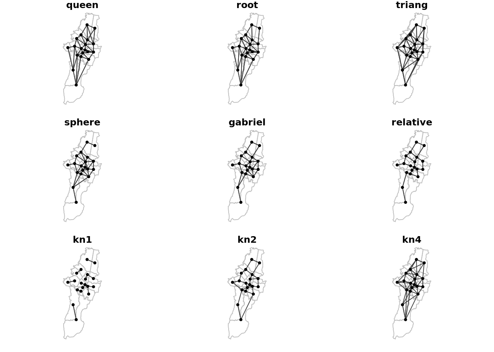

This is a reproducible example of the paper [Pneumonia Sar](). In this research, we perform a spatial autorregresive model analysis to measure the spatial influence of socio-economic, enviromental, behavioural and healthcare factors in pneumonia mortality rates. 

# Getting Started

## Packages

First, we will load the packages needed for processing and analyzing our data.


```r
# Omitting warmings (be carefull)
options(warn = -1)

# Packages
packages <- c('lmtest','RColorBrewer','classInt','spdep','TeachingDemos','shapefiles','sp','maptools',
             'scatterplot3d','geoR','spatial','fBasics','car','aplpack','RODBC','ggplot2','spgrass6',
             'adespatial','RANN','ade4','olsrr','rgeos','rgdal','spdep','spgwr','GWmodel','nnet','olsrr',
             'stats','classInt','gridExtra','lmtest','car','MASS','caret','glmnet')
```

For loading and/or installing the packages, you can run the following command. The packages that are installed in your machine will be automatically loaded. Those that are not installed will be installed and loaded to your R session. Remember to provide permits if linux is used.


```r
# Permits
#Sys.setenv(R_INSTALL_STAGED = FALSE)

# Load packages
for(p in packages){
  if(!require(p,character.only = TRUE)) install.packages(p, dependencies = TRUE)
  library(p,character.only = TRUE)
}
```

```
## Loading required package: lmtest
```

```
## Loading required package: zoo
```

```
## 
## Attaching package: 'zoo'
```

```
## The following objects are masked from 'package:base':
## 
##     as.Date, as.Date.numeric
```

```
## Loading required package: RColorBrewer
```

```
## Loading required package: classInt
```

```
## Loading required package: spdep
```

```
## Loading required package: sp
```

```
## Loading required package: spData
```

```
## To access larger datasets in this package, install the spDataLarge
## package with: `install.packages('spDataLarge',
## repos='https://nowosad.github.io/drat/', type='source')`
```

```
## Loading required package: sf
```

```
## Linking to GEOS 3.6.2, GDAL 2.2.3, PROJ 4.9.3
```

```
## Loading required package: TeachingDemos
```

```
## Loading required package: shapefiles
```

```
## Loading required package: foreign
```

```
## 
## Attaching package: 'shapefiles'
```

```
## The following objects are masked from 'package:foreign':
## 
##     read.dbf, write.dbf
```

```
## Loading required package: maptools
```

```
## Checking rgeos availability: TRUE
```

```
## Loading required package: scatterplot3d
```

```
## Loading required package: geoR
```

```
## --------------------------------------------------------------
##  Analysis of Geostatistical Data
##  For an Introduction to geoR go to http://www.leg.ufpr.br/geoR
##  geoR version 1.8-1 (built on 2020-02-08) is now loaded
## --------------------------------------------------------------
```

```
## Loading required package: spatial
```

```
## Loading required package: fBasics
```

```
## Loading required package: timeDate
```

```
## Loading required package: timeSeries
```

```
## 
## Attaching package: 'timeSeries'
```

```
## The following object is masked from 'package:zoo':
## 
##     time<-
```

```
## Loading required package: car
```

```
## Loading required package: carData
```

```
## 
## Attaching package: 'car'
```

```
## The following object is masked from 'package:fBasics':
## 
##     densityPlot
```

```
## Loading required package: aplpack
```

```
## 
## Attaching package: 'aplpack'
```

```
## The following objects are masked from 'package:TeachingDemos':
## 
##     faces, slider
```

```
## Loading required package: RODBC
```

```
## Loading required package: ggplot2
```

```
## Loading required package: spgrass6
```

```
## Loading required package: XML
```

```
## GRASS GIS interface loaded with GRASS version: (GRASS not running)
```

```
## Loading required package: adespatial
```

```
## Registered S3 methods overwritten by 'adegraphics':
##   method         from
##   biplot.dudi    ade4
##   kplot.foucart  ade4
##   kplot.mcoa     ade4
##   kplot.mfa      ade4
##   kplot.pta      ade4
##   kplot.sepan    ade4
##   kplot.statis   ade4
##   scatter.coa    ade4
##   scatter.dudi   ade4
##   scatter.nipals ade4
##   scatter.pco    ade4
##   score.acm      ade4
##   score.mix      ade4
##   score.pca      ade4
##   screeplot.dudi ade4
```

```
## Registered S3 method overwritten by 'ape':
##   method   from 
##   plot.mst spdep
```

```
## Registered S3 methods overwritten by 'adespatial':
##   method             from       
##   plot.multispati    adegraphics
##   print.multispati   ade4       
##   summary.multispati ade4
```

```
## Loading required package: RANN
```

```
## Loading required package: ade4
```

```
## 
## Attaching package: 'ade4'
```

```
## The following object is masked from 'package:adespatial':
## 
##     multispati
```

```
## The following object is masked from 'package:spdep':
## 
##     mstree
```

```
## Loading required package: olsrr
```

```
## 
## Attaching package: 'olsrr'
```

```
## The following object is masked from 'package:datasets':
## 
##     rivers
```

```
## Loading required package: rgeos
```

```
## rgeos version: 0.5-5, (SVN revision 640)
##  GEOS runtime version: 3.6.2-CAPI-1.10.2 
##  Linking to sp version: 1.4-5 
##  Polygon checking: TRUE
```

```
## Loading required package: rgdal
```

```
## rgdal: version: 1.5-23, (SVN revision 1121)
## Geospatial Data Abstraction Library extensions to R successfully loaded
## Loaded GDAL runtime: GDAL 2.2.3, released 2017/11/20
## Path to GDAL shared files: /usr/share/gdal/2.2
## GDAL binary built with GEOS: TRUE 
## Loaded PROJ runtime: Rel. 4.9.3, 15 August 2016, [PJ_VERSION: 493]
## Path to PROJ shared files: (autodetected)
## Linking to sp version:1.4-5
```

```
## 
## Attaching package: 'rgdal'
```

```
## The following object is masked from 'package:fBasics':
## 
##     getDescription
```

```
## Loading required package: spgwr
```

```
## NOTE: This package does not constitute approval of GWR
## as a method of spatial analysis; see example(gwr)
```

```
## Loading required package: GWmodel
```

```
## Loading required package: robustbase
```

```
## Loading required package: Rcpp
```

```
## Loading required package: spatialreg
```

```
## Loading required package: Matrix
```

```
## 
## Attaching package: 'spatialreg'
```

```
## The following objects are masked from 'package:spdep':
## 
##     as_dgRMatrix_listw, as_dsCMatrix_I, as_dsCMatrix_IrW,
##     as_dsTMatrix_listw, as.spam.listw, can.be.simmed, cheb_setup,
##     create_WX, do_ldet, eigen_pre_setup, eigen_setup, eigenw,
##     errorsarlm, get.ClusterOption, get.coresOption, get.mcOption,
##     get.VerboseOption, get.ZeroPolicyOption, GMargminImage, GMerrorsar,
##     griffith_sone, gstsls, Hausman.test, impacts, intImpacts,
##     Jacobian_W, jacobianSetup, l_max, lagmess, lagsarlm, lextrB,
##     lextrS, lextrW, lmSLX, LU_prepermutate_setup, LU_setup,
##     Matrix_J_setup, Matrix_setup, mcdet_setup, MCMCsamp, ME, mom_calc,
##     mom_calc_int2, moments_setup, powerWeights, sacsarlm,
##     SE_classic_setup, SE_interp_setup, SE_whichMin_setup,
##     set.ClusterOption, set.coresOption, set.mcOption,
##     set.VerboseOption, set.ZeroPolicyOption, similar.listw, spam_setup,
##     spam_update_setup, SpatialFiltering, spautolm, spBreg_err,
##     spBreg_lag, spBreg_sac, stsls, subgraph_eigenw, trW
```

```
## Welcome to GWmodel version 2.2-3.
## The new version of GWmodel 2.2-5 now is ready
```

```
## 
## Attaching package: 'GWmodel'
```

```
## The following objects are masked from 'package:stats':
## 
##     BIC, fitted
```

```
## Loading required package: nnet
```

```
## Loading required package: gridExtra
```

```
## Loading required package: MASS
```

```
## 
## Attaching package: 'MASS'
```

```
## The following object is masked from 'package:olsrr':
## 
##     cement
```

```
## Loading required package: caret
```

```
## Loading required package: lattice
```

```
## Loading required package: glmnet
```

```
## Loaded glmnet 4.1-1
```

## Working directory

It is easier to work in R using a working directory. That way you ensure your inputs and outputs will be loaded and stored in a global directory.


```r
# Set working directory
dir <- '/mnt/d/M.Sc. Gesopatial Tecnologies/GeoMundus/GeoMundus 2019/Neumonia'
setwd(file.path(dir))
```

We will also use some useful functions in the exploratory analisis. Load them all from the *SpatialFunctions* folder. Remember this folder has to be in your current working directory.


```r
# Load some useful functions
funDir <- file.path(dir, 'SpatialFunctions')
spFun <- list.files(funDir, pattern = '.r', full.names = T)
invisible(lapply(spFun, source))
```

And we will add an extra function for resting the plot options everytime we plot.


```r
# Reset par for sequential plotting
resetPar <- function() { dev.new(); op <- par(no.readonly = TRUE); dev.off(); op}
```

# Data

Our data contains the [standardized mortality ratio (SMR)](https://ibis.health.state.nm.us/resource/SMR_ISR.html#:~:text=Standardized%20Mortality%20Ratio%20(SMR)%20is,the%20same%20age%2Fsex%20groups.) of Pneumonia (our study variable) in 19 districts of Bogotá, Colombia for the years 2004, 2007, 2011 and 2014. The data also contains socio-economic, enviromental and healthcare covariates.

As our data is stored in a *shapefile (.shp)* format, we will load it like so.


```r
# Load Data
years <- list('04','07','11','14')
pneuData <- paste0(dir, '/SHPFinal/Neumonia', years, '.shp')
```

And then we will read it using the `sp` package.


```r
# read Data
pneuShp <- lapply(pneuData, st_read)
pneuNames <- as.character(paste0('pneu',years))
names(pneuShp) <- pneuNames
```

# Exploratory Analysis

## Spatial weights matrices

One of the main aspects of any spatial autorregresive model is the contiguity matrix, also known as the spatial weights matrix ($\mathbf{W}$). This matrix encodes the spatial dependence and influence of one region with its neighbors. There are many ways to define $\mathbf{W}$. Usually, an expert can propose a potential spatial weights matrix based on their knowledge of the phenomenon (study variable). For our research, we will consider most of the parametric approaches as we do not make any assumptions about the underlying spatial structure of the SMR variable. 


```r
# Contiguity criteria

# Queen
queenW <- lapply(pneuShp, poly2nb)
# Root
rootW <- lapply(pneuShp, poly2nb, queen = F)

# Distance criteria

# Coords
coords <- lapply(pneuShp, function(x) {st_sfc(st_centroid(x$geometry))})

# Delanuay Triangulation
triangW <- lapply(coords, tri2nb)
# Sphere of Influence
sphereW <- lapply(1:length(pneuNames), function(x) {graph2nb(soi.graph(triangW[[x]], coords[[x]]))})
names(sphereW) <- pneuNames
# Gabriel
gabrielW <- lapply(1:length(pneuNames), function(x) {graph2nb(gabrielneigh(coords[[x]]), sym = T)})
names(gabrielW) <- pneuNames
# Relative Neighbors
relativeW <- lapply(1:length(pneuNames), function(x) {graph2nb(relativeneigh(coords[[x]]), sym = T)})
names(relativeW) <- pneuNames

# K-neighbors critreria

# Polygons IDs
IDs <- row.names(as.data.frame(pneuShp$pneu04))

# K-1 neighbor
kn1W <- lapply(1:length(pneuNames), function(x) {knn2nb(knearneigh(coords[[x]], k = 1), row.names = IDs)})
names(kn1W) <- pneuNames

# K-2 neighbors
kn2W <- lapply(1:length(pneuNames), function(x) {knn2nb(knearneigh(coords[[x]], k = 2), row.names = IDs)})
names(kn2W) <- pneuNames

# K-4 neighbors
kn4W <- lapply(1:length(pneuNames), function(x) {knn2nb(knearneigh(coords[[x]], k = 4), row.names = IDs)})
names(kn4W) <- pneuNames
```

Now we plot the matrices to check the relations among regions.


```r
# Plot weights matrices
op=par(mfrow=c(3,3), oma=c(0,0,0,0), mar=c(1,1,1,1))
matrices <- c('queen','root', 'triang', 'sphere', 'gabriel', 'relative', 'kn1', 'kn2', 'kn4')

for (w in matrices){
  plot(st_geometry(pneuShp$pneu04), border = 'gray')
  plot(get(paste0(w, 'W'))$pneu04, coords$pneu04, add=T,  pch=20, cex.main=1.5 , col="gray25")
  title(w)
}
```

<!-- -->
Now we will evaluate the best matrix for our data. We will use the [Principal coordinates of neighbour matrices (PCNM)](https://www.sciencedirect.com/science/article/abs/pii/S0304380006000925) as our selection criteria. For further details, please refer to the PCNM method.

First we will create a function to extract the AIC of the PCNM method to compare and extract the best matrix per each year.


```r
## Spatial weights matrices PCNM

# Function to get AIC for each matrix
getMatrixAIC <- function(x, w){
  pcnm <- test.W(pneuShp[[x]]$SMR, w[[x]])
  aic <- pcnm$all$AICc
  return(aic)
}
```
 
And then we will get the AIC values.


```r
# empty list
pcnm <- list()
# Get AICs
for (w in matrices){
  aic <- lapply(1:length(pneuNames), function(x){getMatrixAIC(x,get(paste0(w, 'W')))})
  pcnm[[w]] <- aic
}
```

```
## 
## 
## AICc for the null model: -46.1368814476416 
## 
## Best spatial model:
##            AICc NbVar
## MEM15 -68.77277     5
## 
## 
## AICc for the null model: -55.8498077023605 
## 
## Best spatial model:
##           AICc NbVar
## MEM9 -58.97563     5
## 
## 
## AICc for the null model: -32.8846076165118 
## 
## Best spatial model:
##           AICc NbVar
## MEM1 -48.16067     6
## 
## 
## AICc for the null model: -15.1826555101499 
## 
## Best spatial model:
##            AICc NbVar
## MEM15 -31.85952     6
## 
## 
## AICc for the null model: -46.1368814476416 
## 
## Best spatial model:
##            AICc NbVar
## MEM18 -61.15346     3
## 
## 
## AICc for the null model: -55.8498077023605 
## 
## Best spatial model:
##           AICc NbVar
## MEM3 -61.13476     5
## 
## 
## AICc for the null model: -32.8846076165118 
## 
## Best spatial model:
##           AICc NbVar
## MEM16 -48.8688     8
## 
## 
## AICc for the null model: -15.1826555101499 
## 
## Best spatial model:
##            AICc NbVar
## MEM16 -25.39557     6
## 
## 
## AICc for the null model: -46.1368814476416 
## 
## Best spatial model:
##            AICc NbVar
## MEM12 -61.19358     7
## 
## 
## AICc for the null model: -55.8498077023605 
## 
## Best spatial model:
##            AICc NbVar
## MEM16 -66.05321     3
## 
## 
## AICc for the null model: -32.8846076165118 
## 
## Best spatial model:
##            AICc NbVar
## MEM13 -62.92984     3
## 
## 
## AICc for the null model: -15.1826555101499 
## 
## Best spatial model:
##           AICc NbVar
## MEM3 -23.53263     4
## 
## 
## AICc for the null model: -46.1368814476416 
## 
## Best spatial model:
##           AICc NbVar
## MEM3 -53.70998     4
## 
## 
## AICc for the null model: -55.8498077023605 
## 
## Best spatial model:
##           AICc NbVar
## MEM16 -71.8989     9
## 
## 
## AICc for the null model: -32.8846076165118 
## 
## Best spatial model:
##            AICc NbVar
## MEM15 -55.78013     5
## 
## 
## AICc for the null model: -15.1826555101499 
## 
## Best spatial model:
##           AICc NbVar
## MEM8 -24.97818     2
## 
## 
## AICc for the null model: -46.1368814476416 
## 
## Best spatial model:
##            AICc NbVar
## MEM14 -55.85301     5
## 
## 
## AICc for the null model: -55.8498077023605 
## 
## Best spatial model:
##            AICc NbVar
## MEM17 -63.07068     8
## 
## 
## AICc for the null model: -32.8846076165118 
## 
## Best spatial model:
##           AICc NbVar
## MEM4 -57.84765     3
## 
## 
## AICc for the null model: -15.1826555101499 
## 
## Best spatial model:
##           AICc NbVar
## MEM8 -27.43804     2
## 
## 
## AICc for the null model: -46.1368814476416 
## 
## Best spatial model:
##            AICc NbVar
## MEM18 -55.71152     8
## 
## 
## AICc for the null model: -55.8498077023605 
## 
## Best spatial model:
##            AICc NbVar
## MEM12 -71.29338     7
## 
## 
## AICc for the null model: -32.8846076165118 
## 
## Best spatial model:
##            AICc NbVar
## MEM12 -59.65928     5
## 
## 
## AICc for the null model: -15.1826555101499 
## 
## Best spatial model:
##            AICc NbVar
## MEM16 -35.22539     6
## 
## 
## AICc for the null model: -46.1368814476416 
## 
## Best spatial model:
##           AICc NbVar
## MEM7 -59.24907     7
## 
## 
## AICc for the null model: -55.8498077023605 
## 
## Best spatial model:
##           AICc NbVar
## MEM6 -66.80696     5
## 
## 
## AICc for the null model: -32.8846076165118 
## 
## Best spatial model:
##            AICc NbVar
## MEM18 -56.95576     7
## 
## 
## AICc for the null model: -15.1826555101499 
## 
## Best spatial model:
##           AICc NbVar
## MEM18 -20.2536     6
## 
## 
## AICc for the null model: -46.1368814476416 
## 
## Best spatial model:
##           AICc NbVar
## MEM1 -67.48367     6
## 
## 
## AICc for the null model: -55.8498077023605 
## 
## Best spatial model:
##           AICc NbVar
## MEM1 -83.38051     7
## 
## 
## AICc for the null model: -32.8846076165118 
## 
## Best spatial model:
##            AICc NbVar
## MEM15 -58.48591     5
## 
## 
## AICc for the null model: -15.1826555101499 
## 
## Best spatial model:
##          AICc NbVar
## MEM5 -42.9033    10
## 
## 
## AICc for the null model: -46.1368814476416 
## 
## Best spatial model:
##           AICc NbVar
## MEM1 -53.45341     4
## 
## 
## AICc for the null model: -55.8498077023605 
## 
## Best spatial model:
##          AICc NbVar
## MEM1 -80.2701    10
## 
## 
## AICc for the null model: -32.8846076165118 
## 
## Best spatial model:
##            AICc NbVar
## MEM11 -70.07799    10
## 
## 
## AICc for the null model: -15.1826555101499 
## 
## Best spatial model:
##           AICc NbVar
## MEM4 -29.22466     5
```

```r
# AICs per year and matrix
pcnm <- as.data.frame(do.call(rbind, pcnm))
names(pcnm) <- pneuNames
```
These are the best matrices per year based on the AIC value.


```r
# Best weights matrices per year (based on AIC)
bestMatrices <- lapply(1:length(pneuNames),function(x){rownames(pcnm[which.min(pcnm[[x]]),])})
names(bestMatrices) <- pneuNames # 2004: queen, 2007: kn2, 2011: kn4, 2014; kn2
bestMatrices
```

```
## $pneu04
## [1] "queen"
## 
## $pneu07
## [1] "kn2"
## 
## $pneu11
## [1] "kn4"
## 
## $pneu14
## [1] "kn2"
```


